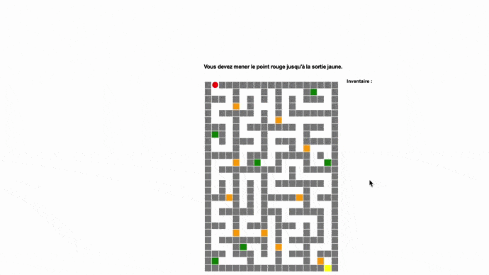
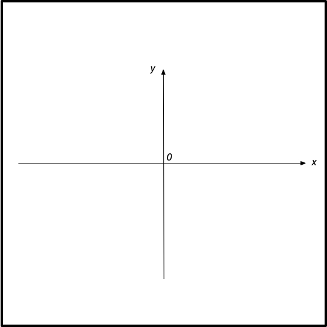
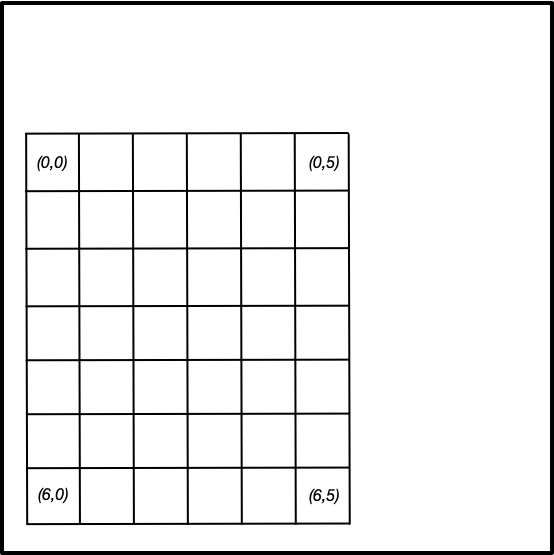
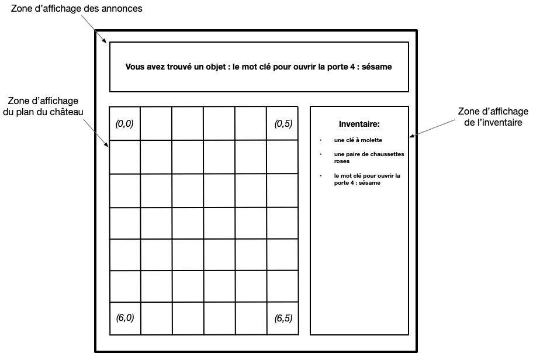

# Pythescape

## Projet de fin de formation Fun-MOOC

### Présentation du projet

Lancelot entre dans le château au sommet du Python des Neiges, muni de son précieux sac de rangement et de sa torche fraîchement allumée aux feux de Beltane. Il doit trouver la statue de sainte Axerror, le chef-d’oeuvre de Gide de Rome, dit le « tyran malfaisant éternel ».

Heureusement, pour l’aider dans sa quête, Merlin, son maître, lui a fourni un plan minutieux des salles et des couloirs du château. Ce plan lui sera fort utile, vu l’énormité du bâtiment, tant par sa taille que par le nombre de ses pièces !

Avant de partir, Merlin lui a donné la clef de la porte d’entrée du château et lui a prodigué moults conseils, dont celui de bien garder tous les objets qu’il trouvera lors de sa quête : ceux-ci lui permettront de répondre aux diverses énigmes que ne manqueront pas de poser les gardes postés devant les portes à l’intérieur du château.

Merlin a affirmé à son disciple que, s’il procède avec intelligence, sa quête sera satisfaite.

#### EN BREF



Ce projet, si vous le menez jusqu’au bout, va vous faire programmer un petit jeu du type <em>jeu d’évasion (escape game)</em> dans lequel le joueur commande au clavier les déplacements d’un personnage au sein d’un « château » représenté en plan. Le château est constitué de cases vides (pièces, couloirs), de murs, de portes, que le personnage ne pourra franchir qu’en répondant à des questions, d’objets à ramasser, qui l’aideront à trouver les réponses à ces questions et de la case de sortie / quête du château. Le but du jeu est d’atteindre cette dernière.

Le programme utilisera le module turtle comme interface graphique et comportera deux parties principales :
1. le tracé du plan du château,
2. la gestion du jeu sur le plan tracé (gestion des déplacements du personnage au sein du château, affichage des objets recueillis, gestion de l’ouverture des portes).

Les données nécessaires (plan du château, objets, portes) sont encodées dans 3 fichiers texte. Vous disposerez d’un jeu de fichiers de données que nous vous proposons et devrez réaliser un programme de jeu qui met en œuvre ces données. Vous pourrez ensuite si vous le souhaitez encoder votre propre château en préparant d’autres fichiers de données, qui tourneront avec le même programme. Votre château pourra aussi bien être du type labyrinthe (entièrement fait de couloirs étroits, sans portes) que du type escape game (un ensemble de pièces, entre lesquelles un personnage circule pour rassembler des objets lui permettant de répondre à des questions ou résoudre des énigmes).

Ce projet vous permettra d’écrire un code plus substantiel que ce que nous vous demandons ailleurs dans le cours, et va vous demander de manipuler de nombreux concepts vus tout au long du cours.

Il vous est demandé que votre programme puisse gérer divers jeux de données construits sur les mêmes principes que les nôtres. Cela permettra à chacun des participants de tester son programme sur les données proposées par d’autres.

### Niveaux de projet

Dans le cadre de ce projet, 4 niveaux de jeux peuvent être réalisés correspondant à des difficultés croissantes :

+ **Niveau 1 : construction et affichage du plan du château.** Ce niveau consiste à tracer correctement le plan du château à partir du fichier de données. La gestion du jeu après affichage du plan ne fait pas partie de ce niveau.
+ **Niveau 2 : en plus du niveau 1, la gestion des déplacements au clavier, sans portes ni objets à ramasser.** Ce niveau consiste à gérer les déplacements d’un personnage dans le plan construit au niveau 1. Ici on suppose qu’aucun objet ni porte n’est présent dans le plan : leur gestion n’est pas prise en compte.
  + On déplace le personnage de case en case à l’aide des 4 flèches du clavier.
  + Le personnage ne doit pas pouvoir traverser les murs ni sortir du plan.
  + Si le personnage arrive sur la case quête / sortie du château, un message lui annonce qu’il a gagné.
  + **Option non demandée, si vous voulez aller plus loin :** les cases déjà parcourues par le personnage peuvent être affichées dans une couleur spécifique, de façon à ce que la trace de son parcours soit conservée.
+ **Niveau 3 : niveaux 1 + 2 + gestion des objets à ramasser.** Dans ce niveau, il y a dans le labyrinthe des objets que le joueur doit collecter. Outre le fichier contenant le plan, un second fichier de données contient la liste des objets et la case où chaque objet se trouve.
  + Les cases où se trouve un objet doivent apparaître dans une couleur spécifique.
  + Lorsque le joueur se déplace sur une case contenant un objet, un message lui signale qu’il a trouvé un objet, et ce dernier s’ajoute à l’inventaire affiché en permanence à côté du plan. La case où était l’objet devient vide, puisque l’objet a été ramassé.
  + **Option non demandée, si vous voulez aller plus loin :** on peut prévoir que la sortie du labyrinthe ne sera accessible qu’une fois tous les objets rassemblés.
+ **Niveau 4 (escape game complet) : niveaux 1 + 2 + 3 + gestion des portes.** Ce niveau consiste à ajouter dans la labyrinthe des portes que le joueur doit ouvrir en répondant à des questions. Le troisième fichier de données contient la liste des portes avec les questions et réponses associées.
  + Les cases où se trouve une porte doivent apparaître dans une couleur spécifique.
  + Lorsque le joueur tente d’accéder à une porte, la question associée lui est posée.
  + S’il répond correctement, la porte s’ouvre et il peut alors la franchir. La case de la porte apparaît alors comme une case vide.
  + S’il ne répond pas ou s’il donne une mauvaise réponse, la porte reste fermée et infranchissable.

### En pratique

#### 1. SYSTÈME DE COORDONNÉES
Le module turtle utilise un système de coordonnées dont l’origine (0, 0) est au centre de la fenêtre. L’axe des abscisses est orienté vers la droite, l’axe des ordonnées est orienté vers le haut.



Dans ce qui suit, nous parlerons de _pixel turtle_ pour parler de coordonnées dans la fenêtre turtle. Nous utiliserons les _pixels turtle_ de `(-240, -240)` à `(240, 240)`.

Pour faciliter les discussions, nous vous demandons de numéroter les cases du plan du château :
+ en numérotant les lignes de haut en bas et les colonnes de gauche à droite,
+ en commençant la numérotation des lignes comme des colonnes à partir de 0 (convention habituelle de Python).

La case (0, 0) est donc située en haut et à gauche du plan et la case `(0, 5)` est située 5 cases à sa droite. la case `(6, 5)` sera la 6e case depuis la gauche, sur la 7e ligne depuis le haut.



**Point important :** Lorsque vous calculerez les coordonnées nécessaires pour tracer une case, souvenez-vous que le numéro de ligne augmente quand l’ordonnée « y » (pour la fenêtre turtle) diminue.

#### 2. OCCUPATION DES ZONES DE LA FENÊTRE TURTLE

Vous aurez besoin de distinguer trois zones différentes dans la fenêtre turtle :
+ un bandeau en haut pour l’affichage d’annonces, qui peut par exemple faire 40 _pixels turtle_ de hauteur, que vous pourrez définir par les coordonnées en _pixels turtle_ du début de la ligne de texte,
+ en-dessous, une large zone à gauche pour l’affichage du plan, qu’il sera pratique de définir par les coordonnées de son coin inférieur gauche (abscisse et ordonnée minimales de la zone) et de son coin supérieur droit (abscisse et ordonnée maximales de la zone),
+ la partie restant à droite sera la colonne d’affichage de l’inventaire, que vous pourrez définir par les coordonnées en pixels turtle du début de la première ligne de texte de l’inventaire.



#### 3. DESCRIPTION DES FICHIERS DE DONNÉES

Les données correspondant à un jeu figurent dans trois fichiers texte dont la structure est décrite ci-dessous.

<ol type="a">
  <li> fichier texte <code>plan_chateau.txt</code> qui contient les données du plan du château. Il comporte un certain nombre de lignes, toutes de la même longueur, représentant une ligne de cases du plan. Chaque ligne du fichier est une suite d’entiers séparés par des espaces, où chaque entier représente une case. Les valeurs de ces entiers codent chaque nature de case :
    <ul>
      <li>valeur 0 pour une case vide,</li>
      <li>valeur 1 pour un mur (infranchissable),</li>
      <li>valeur 2 pour la case de sortie/victoire,</li>
      <li>valeur 3 pour une porte qui sera franchissable en répondant à une question,</li>
      <li>valeur 4 pour une case contenant un objet à collecter.</li>
    </ul>
  </li>
  <li>Un fichier texte <code>dico_objets.txt</code> qui contient une liste d’objets associés aux cases sur lesquelles on les trouve.<br>
    Chaque ligne sera du type :<br>
    <code>(x, y), "objet"</code><br>
    Ainsi, chaque ligne contient :
    <ul>
      <li>un couple d’entiers positifs ou nuls (numéro de ligne, numéro de colonne) indiquant la case où se trouve l’objet,</li>
      <li>puis une virgule et une espace,</li>
      <li>puis une chaînes de caractères décrivant l’objet.</li>
    </ul>
    Par exemple :<br>
    <code>(12, 3), "un oreiller magique"</code><br>
    signifiera que la case de coordonnées <code>(12, 3)</code> contient l’objet « un oreiller magique ».
  </li>
  <li>Un fichier texte <code>dico_portes.txt</code> qui contient une liste de questions/réponses associées aux portes.<br>
    Chaque ligne sera du type :<br>
    <code>(x, y), ("question", "réponse")</code><br>
    Ainsi, chaque ligne contient :
    <ul>
      <li>un couple d’entiers positifs ou nuls (numéro de ligne, numéro de colonne) indiquant la case où se trouve la porte,</li>
      <li>puis une virgule et une espace,</li>
      <li>puis un couple de chaînes de caractères avec une question et une réponse.</li>
    </ul>
    Par exemple :<br>
    <code>(21, 12), ("Capitale de la Belgique ?", "Bruxelles")</code><br>
    signifiera que pour franchir la porte située en case <code>(21, 12)</code>, il faudra répondre « Bruxelles » à la question « Capitale de la Belgique ? ».
  </li>
</ol>

#### 4. CONSTANTES ET JEU DE DONNÉES TYPE

Pour vous aider à concevoir et à tester votre programme, un jeu de données comportant trois fichiers types sur le format spécifié plus haut est donné ici :
+ fichier plan_chateau.txt
+ fichier dico_objets.txt
+ fichier dico_portes.txt

Il s’agit d’un escape game très simple avec des questions portant sur Python. Nous vous suggérons de placer ces trois fichiers dans le même dossier que votre programme, pour pouvoir les appeler sans devoir décrire leur place dans l’arborescence.

Nous supposons aussi que la porte d'entrée du château est ouverte (elle est donc vue comme une case vide), qu'elle est en position (0, 1) et que le personnage s'y trouve initialement.

Un fichier `CONFIGS.py` vous est fourni : il donne les dimensions, couleurs et quelques constantes utilisées par notre programme de référence. Vous pouvez télécharger ce fichier et copier/coller ces définitions dans votre script ou mieux placer ce fichier `CONFIGS.py` dans le même répertoire que votre script et ajouter à ce dernier la ligne

```python
 from CONFIGS import *
```
 dont l'effet en pratique sera le même qu'un copier/coller.
```python
ZONE_PLAN_MINI = (-240, -240)  # Coin inférieur gauche de la zone d'affichage du plan
ZONE_PLAN_MAXI = (50, 200)  # Coin supérieur droit de la zone d'affichage du plan
POINT_AFFICHAGE_ANNONCES = (-240, 240)  # Point d'origine de l'affichage des annonces
POINT_AFFICHAGE_INVENTAIRE = (70, 210)  # Point d'origine de l'affichage de l'inventaire

# Les valeurs ci-dessous définissent les couleurs des cases du plan
COULEUR_CASES = 'white'
COULEUR_COULOIR = 'white'
COULEUR_MUR = 'grey'
COULEUR_OBJECTIF = 'yellow'
COULEUR_PORTE = 'orange'
COULEUR_OBJET = 'green'
COULEUR_VUE = 'wheat'
COULEURS = [COULEUR_COULOIR, COULEUR_MUR, COULEUR_OBJECTIF, COULEUR_PORTE, COULEUR_OBJET, COULEUR_VUE]
COULEUR_EXTERIEUR = 'white'

# Couleur et dimension du personnage
COULEUR_PERSONNAGE = 'red'
RATIO_PERSONNAGE = 0.9  # Rapport entre diamètre du personnage et dimension des cases
POSITION_DEPART = (0, 1)  # Porte d'entrée du château

# Désignation des fichiers de données à utiliser
fichier_plan = 'plan_chateau.txt'
fichier_questions = 'dico_questions.txt'
fichier_objets = 'dico_objets.txt'
```
Nous supposons donc que la fenêtre turtle est contenue dans un rectangle (de coin inférieur gauche en `(-240, -240)` et de coin supérieur droit `(240, 240)`) et est composée de 3 zones :
+ la zone affichage du plan (de coin inférieur gauche en `(-240, -240)` et de coin supérieur droit `(50, 200)`),
+ la zone annonces avec les textes qui seront affichés en `(-240, 240)` (chaque annonce devra effacer la précédente),
+ la zone affichage de l’inventaire (de coin supérieur gauche en `(70, 210)` et de coin supérieur droit en `(240, 210)`).
